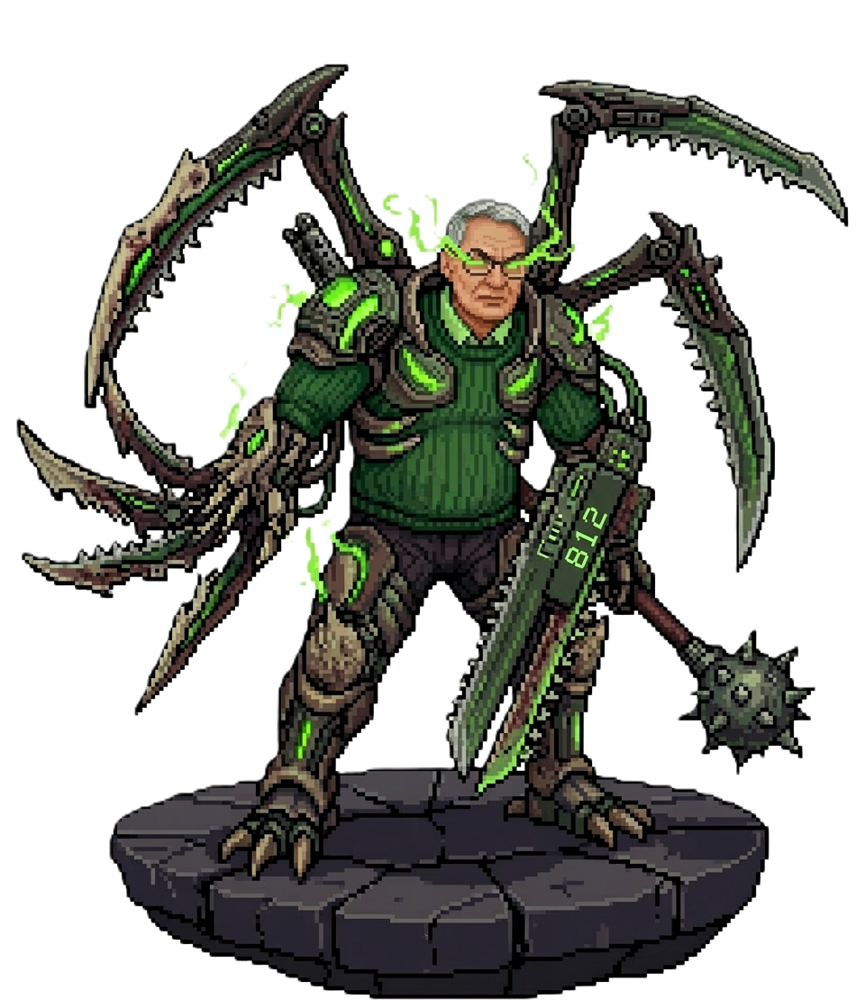

# Tears of BFU

Top-down roguelike shooter with procedural rooms, Bullet Time, bosses, loot, and multi-floor basement progression.

## Overview

`Tears of BFU` is a course project built in `Godot 4.6`.  
The game combines room-to-room combat, procedural generation, item builds, boss fights, and fast arcade shooting.

## Screens and Style

  
  
  

  
  
  

## Main Features

- Main menu with nickname, audio settings, mode selection, and leaderboard.
- Procedural floor generation with normal rooms, start rooms, and boss rooms.
- Multi-floor progression with `Basement` transitions.
- Bullet Time mechanic with charge, music slowdown, and screen effects.
- Different enemy archetypes: melee, ranged, jumpers, boss phases.
- Mutated enemies with random modifiers.
- Passive and active items with build variety.
- Chests, keys, healing pickups, and reward rooms.
- Minimap, score, timer, inventory, run statistics, and death summary.
- Music, sound effects, transitions, camera feedback, and boss cutscenes.

## Controls

- `W A S D` — move
- `Arrow Keys` — shoot
- `Shift` — Bullet Time
- `E` — use active item
- `Q` — open inventory overlay
- `Esc` — pause
- `R` — hold to restart

## Systems Implemented

### Combat

- Automatic shooting while holding fire direction.
- Contact, projectile, leap, and boss burst attacks.
- Bullet Time charge system with limited duration.
- Player damage feedback with sound and visual response.

### Progression

- Floor-to-floor scaling for enemies and bosses.
- Weighted enemy layout generation by basement depth.
- Mutation chance that grows with progression.
- Boss reward flow and next-floor hatch transition.

### Loot

- Passive items that modify stats and combat behavior.
- Active items with rarity tiers and color-coded presentation.
- Chest rewards and rare enemy drops.
- Pedestal presentation for major items.

### UI

- Health hearts, minimap, keys, active item slot.
- Bullet Time meter.
- Timer and score under the minimap.
- Inventory screen with collected passives and detailed stats.
- Game Over screen with kills, score, time, and reached basement.
- Local profile stats persistence and web leaderboard integration.

## Project Structure

- `scenes/` — main scenes, rooms, player, enemies, UI
- `scripts/` — gameplay logic, room management, items, HUD, audio
- `assets/` — sprites, item icons, music, sound effects, shaders

## Tech

- Engine: `Godot 4.6`
- Language: `GDScript`
- Rendering: `Forward+`

## Notes

This repository contains the final course-game prototype with procedural gameplay, polished UI, effects, and multiple gameplay systems implemented during the lab sequence.

## Web Leaderboard Backend

The project includes a simple file-based backend in `web_backend/api/leaderboard.php` with persistent data stored in `web_backend/data/leaderboard.json`.

To deploy it with the website:

1. Copy the `web_backend/api` and `web_backend/data` folders to your web host next to the exported game files.
2. Make sure PHP can write to `web_backend/data/leaderboard.json`.
3. Set the menu API URL to the public path of `leaderboard.php`.
   Example: `api/leaderboard.php`

The menu stores nickname, API URL, audio settings, and local cumulative stats in `user://settings.cfg`.

Desktop fallback:

- If the game is launched locally as an app and the API URL is not an `http/https` address, leaderboard results are saved to `user://leaderboard_local.json`.
- If the game runs on the web, or if you enter an explicit remote `http/https` API URL, it uses the PHP backend instead.
